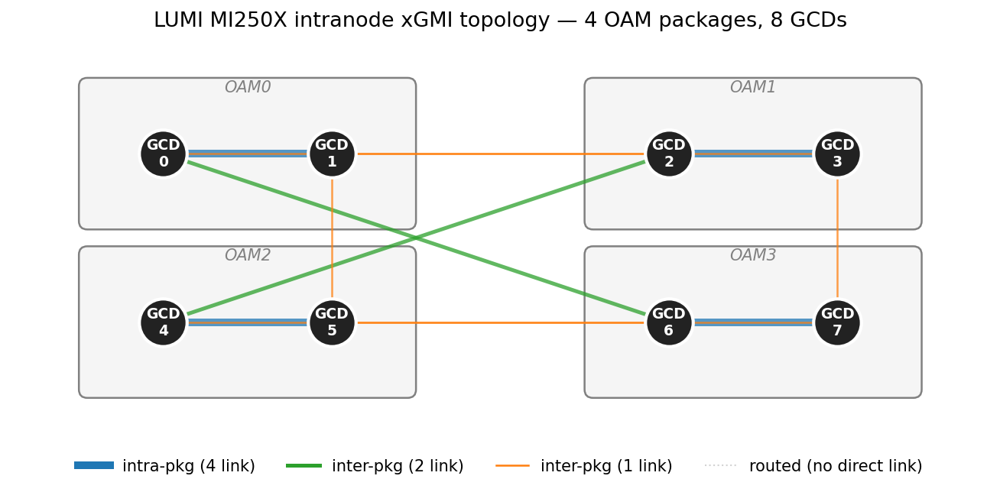
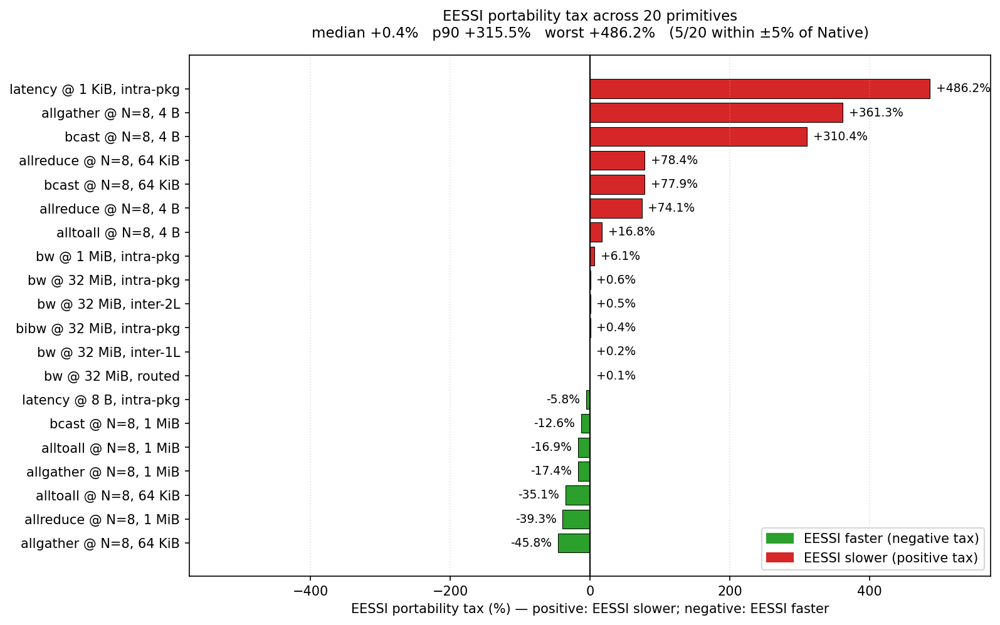
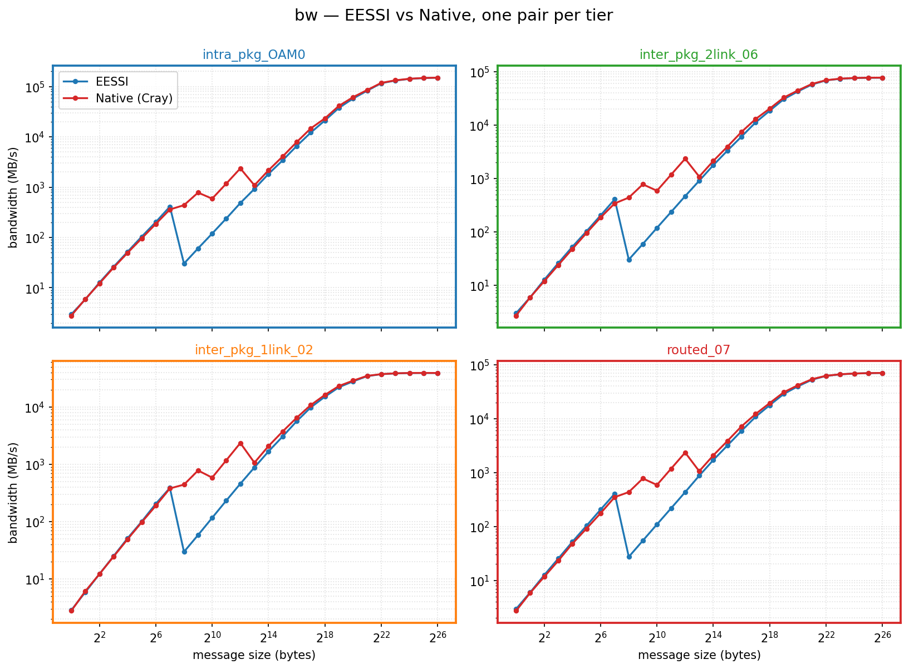
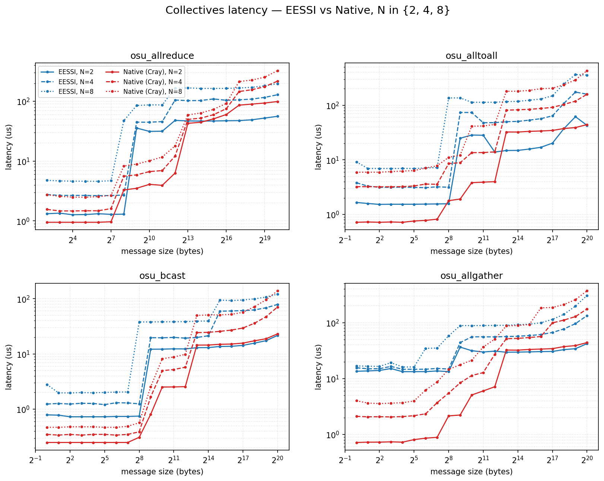
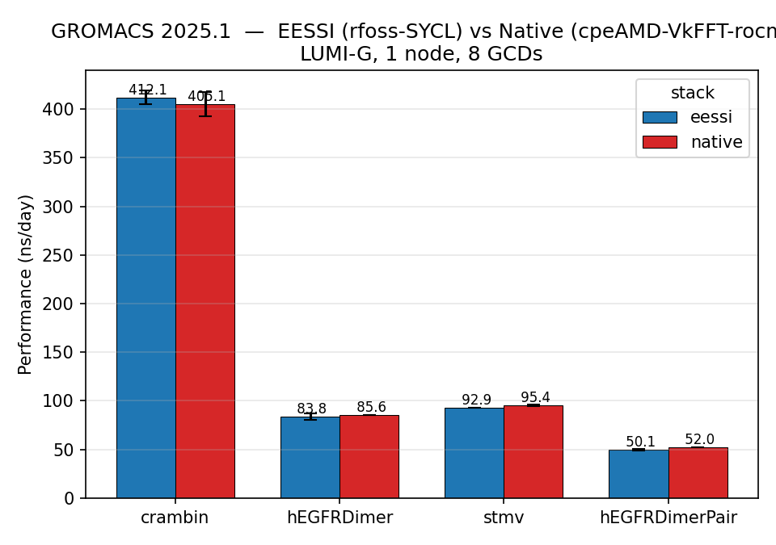
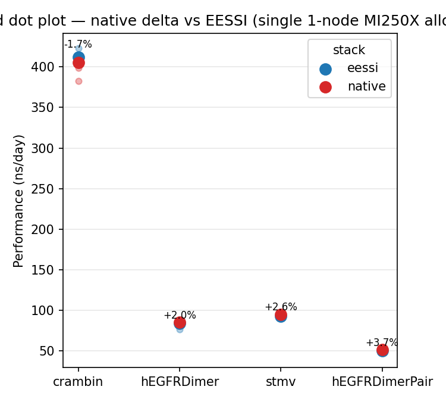

# thesis-benchmarks — EESSI vs native software stack on LUMI-G (MI250X)

Benchmark suite for a master's thesis comparing the **EESSI** software stack
(CernVM-FS-delivered, EESSI 2025.06, OpenMPI 5 + UCX) against the **native
Cray/AMD stack** (LUMI/25.03 PrgEnv-amd + Cray MPICH) on
[LUMI](https://www.lumi-supercomputer.eu/) standard-g/dev-g nodes
(EuroHPC, 8× AMD MI250X = 8 GCDs per node).

The thesis question is the **portability tax**: how much performance, if any,
do you give up by running scientific workloads from the convenient,
reproducible CVMFS-delivered EESSI stack instead of the hand-tuned vendor
stack? We answer it at three levels — raw GPU-to-GPU interconnect microbenchmarks
(intra-node and inter-node) and a real molecular-dynamics application (GROMACS).

> **Note on directory names.** The phase directories were renamed
> `1_`/`2_`/`3_` by topic. Some in-tree docs still use the original working
> names — `4_osu` = `1_osu_intranode`, `6_gromacs` = `2_gromacs_intranode`,
> `7_osu_internode_thesis` = `3_osu_internode`, `5_osu_internode` = the CXI
> rebuild that lives outside this repo. Treat the `N_*` directory names below
> as authoritative.

---

## The three phases

| Dir | Phase | Question | Tool | Scope |
|---|---|---|---|---|
| [`1_osu_intranode/`](1_osu_intranode/) | Intra-node interconnect | Does EESSI match native on the on-node xGMI fabric? | OSU Micro-Benchmarks 7.5 | 1 node, GCD↔GCD pairs across all 4 xGMI tiers |
| [`2_gromacs_intranode/`](2_gromacs_intranode/) | Real application | Does the microbenchmark portability tax show up in a real MD code? | GROMACS 2025.1 (SYCL/AdaptiveCpp) | 1 node, 8 GCDs, 4 HECBioSim/STMV systems |
| [`3_osu_internode/`](3_osu_internode/) | Inter-node interconnect | Does EESSI match native over the Slingshot-11 / CXI network? | OSU Micro-Benchmarks 7.5 | 2 nodes, 8 cross-node GCD pairs |
| [`rocm-topo/`](rocm-topo/) | Hardware ground truth | What is the actual on-node xGMI topology? | `rocm-smi` KFD dump + parser | 1 node, 8×8 link/bandwidth matrices |

Each phase carries its own detailed `README.md` and (for the OSU/GROMACS
phases) `*_ANALYSIS.md` writeups. **This file is the map; the per-phase
READMEs are the territory.**

---

## Hardware: the MI250X node and its xGMI topology

A LUMI-G node is 4 MI250X packages = 8 GCDs (GPU compute dies), wired by xGMI
in a fixed asymmetric topology. The ground truth, extracted by
[`rocm-topo/parse_kfd.py`](rocm-topo/parse_kfd.py) from the KFD node properties,
is the per-link-count and per-bandwidth 8×8 matrix:

```
Max xGMI bandwidth (GB/s), GPU↔GPU         Number of parallel xGMI links
       0    1    2    3    4    5    6    7         0  1  2  3  4  5  6  7
  0    -  200   50    0    0    0  100    0     0   -  4  1  0  0  0  2  0
  1  200    -    0   50    0   50    0    0     1   4  -  0  1  0  1  0  0
  2   50    0    -  200  100    0    0    0     2   1  0  -  4  2  0  0  0
  3    0   50  200    -    0    0    0   50     3   0  1  4  -  0  0  0  1
  4    0    0  100    0    -  200   50    0     4   0  0  2  0  -  4  1  0
  5    0   50    0    0  200    -    0   50     5   0  1  0  0  4  -  0  1
  6  100    0    0    0   50    0    -  200     6   2  0  0  0  1  0  -  4
  7    0    0    0   50    0   50  200    -     7   0  0  0  1  0  1  4  -
```

This collapses into **four connectivity tiers**, which every OSU pair label
in phase 1 maps onto:

| Tier | Pairs | xGMI links | Nominal uni-directional peak |
|---|---|---|---|
| `intra_pkg` | `{0,1} {2,3} {4,5} {6,7}` | 4 | ~200 GB/s |
| `inter_pkg_2link` | `{0,6} {2,4}` | 2 | ~100 GB/s |
| `inter_pkg_1link` | `{0,2} {1,3} {1,5} {3,7} {4,6} {5,7}` | 1 | ~50 GB/s |
| `routed` | everything else | 0 (hops via an intermediate GCD) | — |



*Phase-1 figure H1: the on-node xGMI schematic the tier labels are derived from.*

---

## The two software stacks

| | EESSI | Native |
|---|---|---|
| Delivery | CernVM-FS (`/cvmfs/software.eessi.io`), EESSI 2025.06 | `/appl/lumi`, LUMI/25.03 |
| MPI | OpenMPI 5.0.7 + UCX (ROCm-aware) | Cray MPICH (libfabric/CXI) |
| OSU launcher | `mpirun -n N …` | `srun --ntasks=N … bash -c 'export ROCR_VISIBLE_DEVICES=…; exec $BIN'` |
| GROMACS | `GROMACS/2025.1-rfoss-2025a-SYCL` | `GROMACS/2025.1-cpeAMD-25.03-VkFFT-rocm` |
| GPU-aware path | UCX `rocm_ipc`/`rocm_copy` (automatic) | `MPICH_GPU_SUPPORT_ENABLED=1` (+ `GMX_FORCE_GPU_AWARE_MPI=1` for GROMACS) |

The launcher difference is intentional and load-bearing: `srun` does not forward
per-rank `ROCR_VISIBLE_DEVICES` the way `mpirun` does, hence the `bash -c`
wrapper on the native side.

---

## Methodology common to all phases

- **One stack per SLURM job.** Each script takes a positional `eessi` /
  `native` argument and only sets up that stack in a fresh shell. The
  dual-stack-in-one-job approach collided with LUMI's Lmod SitePackage
  takeover (`module load LUMI/25.03` fails after EESSI's CVMFS init). Cross-stack
  comparisons therefore span jobs, which is fine — node-to-node variance is small.
- **Warm-up + recorded runs.** OSU phases use `NUM_RUNS=6` (1 discarded warm-up
  + 5 recorded). GROMACS uses `NUM_RUNS=7` (1 warm-up + 6 recorded, matching the
  AMD ROCm Blog recipe).
- **Device buffers.** OSU runs with `-d rocm D D` (GPU→GPU); GROMACS offloads
  `-nb gpu -pme gpu -bonded gpu` with GPU-direct comms.
- **Reproducible artifacts.** Every job emits, under `results/`, a
  `<name>_<stack>_<jobid>` quartet: `.csv` (parsed data), `.log` (raw output),
  `.out` (SLURM stdout), and a `.meta` sidecar (hostname, nodelist, xname,
  `rocm-smi` topology, module/version snapshot) so any row traces back to a known
  hardware state.
- **`HSA_ENABLE_SDMA=0`** hardcoded in the OSU phases (the `sdma_enabled` CSV
  column is kept for schema stability but is always `0`).
- SLURM account `project_462000226`; partitions `dev-g` / `standard-g`; EESSI
  jobs add `--constraint=eessi`.

---

## Phase 1 — [`1_osu_intranode/`](1_osu_intranode/): on-node interconnect

Paper-grade OSU pt2pt + collective + RMA sweep across a tier-balanced set of 12
GCD pairs (3 `intra_pkg` + 2 `inter_pkg_2link` + 4 `inter_pkg_1link` + 3
`routed`), every primitive run on both stacks. Modeled after De Sensi et al.,
*"Exploring GPU-to-GPU Communication,"* SC'24 ([arXiv:2408.14090](https://arxiv.org/abs/2408.14090)).

**Benchmarks run** (`A1`–`A9` in the per-phase README):

| Family | Scripts | What |
|---|---|---|
| pt2pt bandwidth / latency | `osu_bw.sh`, `osu_bibw.sh`, `osu_latency.sh` | uni-, bi-directional BW + ping-pong latency, 12 pairs |
| host-buffer baseline | `osu_bw_host.sh` | `H H` reference, 4 pairs |
| collectives | `osu_collectives.sh` | allreduce / alltoall / bcast / allgather, N ∈ {2,4,8} |
| RCCL direct | `osu_xccl.sh` | OSU XCCL → RCCL, EESSI-only, N=8 |
| multi-pair BW | `osu_mbw_mr.sh` | concurrent-pair aggregate BW + message rate |
| one-sided RMA | `osu_put_bw.sh`, `osu_get_bw.sh` | MPI put/get, 12 pairs |
| protocol sweeps | `osu_protocol_{eessi,native,nccl}.sh` | UCX_RNDV_THRESH / MPICH_GPU_IPC_THRESHOLD / NCCL levers |
| tuning re-runs | `*_fixed_rndv.sh`, `*_ucc_shm.sh` | apply the winning knob, re-measure |

### Headline result: bulk bandwidth is a tie; the tax is at small messages

At ≥1 MiB, EESSI and native are statistically indistinguishable on every tier —
the portability tax vanishes at the bandwidth plateau:

**Table T1 — peak bandwidth by tier** ([figures/tables/T1_tier_summary_bw_peak.csv](1_osu_intranode/figures/tables/T1_tier_summary_bw_peak.csv)):

| Tier | EESSI (MB/s) | Native (MB/s) | EESSI / native |
|---|---:|---:|---:|
| `intra_pkg` | 147 842 | 147 407 | 1.003 |
| `inter_pkg_2link` | 77 094 | 77 085 | 1.000 |
| `inter_pkg_1link` | 39 039 | 39 038 | 1.000 |
| `routed` | 69 880 | 69 976 | 0.999 |

The cost lives at **small messages**: UCX's default eager→rendezvous switch
produces a 256 B bandwidth cliff (EESSI/native ratio drops to ~0.06 on `osu_bw`),
and small-message collectives are 12–66× slower on bcast/alltoall. Both are
recoverable by tuning — `UCX_RNDV_THRESH=1024` and `UCC_TLS=ucp,shm,self`
respectively — and the `_fixed_rndv` / `_ucc_shm` re-runs confirm the cliff
closes. The single-figure thesis summary is the portability-tax bar chart:



*Figure P3: signed portability tax across ~20 primitives. Positive = native
faster (EESSI pays a tax); negative = EESSI faster.*



*Figure B3a: per-pair `osu_bw` curves, both stacks overlaid — the curves are
on top of each other everywhere except the small-message knee.*

### The collective crossover

Below ~8 KiB native wins collectives (lower launch overhead); above ~128 KiB
**EESSI is 15–40% faster** — the headline EESSI win:

**Table T2 (collectives extract)** ([figures/tables/T2_portability_summary.csv](1_osu_intranode/figures/tables/T2_portability_summary.csv)):

| Collective (N=8) | 4 B | 64 KiB | 1 MiB |
|---|---:|---:|---:|
| `allreduce` tax % | +74% | +78% | **−39%** |
| `alltoall` tax % | +17% | **−35%** | **−17%** |
| `bcast` tax % | +310% | +78% | **−13%** |
| `allgather` tax % | +361% | **−46%** | **−17%** |



*Figure F1: per-collective latency curves; the curves cross — native owns the
left (small), EESSI owns the right (large).*

The `figures/` subdirectory generates ~35 PNGs (B/D/E/F/G/H/I/P series) and 3
summary CSVs; see [`1_osu_intranode/figures/README.md`](1_osu_intranode/figures/README.md)
for the full catalogue and `run_all.sh` to regenerate.

A standalone investigation of the small-message dip — *"MI250X xGMI Small-Message
Bandwidth Dip"* — lives as a PDF and `slow_zone_explainer.md` in the phase dir.

---

## Phase 2 — [`2_gromacs_intranode/`](2_gromacs_intranode/): does the tax reach a real application?

GROMACS 2025.1 (identical major version and SYCL/AdaptiveCpp backend on both
stacks) on one LUMI-G node, 8 GCDs, following the
[AMD ROCm Blog LUMI recipe](https://rocm.blogs.amd.com/artificial-intelligence/gromacs-lumi-guide/README.html)
verbatim. Four HECBioSim/STMV systems spanning the size regimes:

| Benchmark | Atoms | Regime |
|---|---:|---|
| Crambin | ~20k | kernel-launch overhead-bound |
| hEGFRDimer | ~465k | PME-on-GPU sweet spot |
| STMV | ~1.06M | canonical MI250X comparator (Páll et al. CUG'24) |
| hEGFRDimerPair | ~3M | memory + xGMI bandwidth-bound |

### Result: within ±3% — the microbenchmark tax does not propagate

Mean performance over 6 recorded runs ([results/perf.csv](2_gromacs_intranode/results/perf.csv)):

| Benchmark | EESSI (ns/day) | Native (ns/day) | EESSI / native |
|---|---:|---:|---:|
| Crambin | 412.1 | 405.1 | **1.017** |
| hEGFRDimer | 83.8 | 85.6 | 0.979 |
| STMV | 92.9 | 95.4 | 0.974 |
| hEGFRDimerPair | 50.1 | 52.0 | 0.963 |

EESSI is marginally ahead on the tiny overhead-bound system and marginally
behind on the large bandwidth-bound ones — but everything is within ~3%, well
inside run-to-run noise. **The small-message microbenchmark penalty does not
translate into application slowdown**, because GROMACS' GPU-direct halo
exchanges live in the bulk-transfer regime where the two stacks tie.



*`perf_bars.png`: mean ns/day per system, EESSI vs native side by side.*



*`perf_pairs.png`: per-run spread, confirming the differences are within noise.*

Per-system thesis writeups: [`STMV_ANALYSIS.md`](2_gromacs_intranode/STMV_ANALYSIS.md),
[`CRAMBIN_ANALYSIS.md`](2_gromacs_intranode/CRAMBIN_ANALYSIS.md),
[`HEGFRDIMER_ANALYSIS.md`](2_gromacs_intranode/HEGFRDIMER_ANALYSIS.md) (each
cross-validates against the published AMD ROCm Blog numbers).

> Inputs (`GROMACS_Benchmark_Suite/`) are **not committed** (TPR blobs exceed
> GitHub's file-size limit). Rebuild with `bash fetch_benchmarks.sh` on a login
> node before submitting.

---

## Phase 3 — [`3_osu_internode/`](3_osu_internode/): off-node over Slingshot-11 / CXI

The inter-node companion to phase 1: the same per-script structure, but every
launcher targets 2 nodes and 8 cross-node GCD pairs over the
[Slingshot-11](https://docs.lumi-supercomputer.eu/hardware/network/) network.
The EESSI side runs over a **CXI-rebuilt OpenMPI stack** (libfabric + CXI
provider, built via the EasyConfigs in [`easyconfigs/`](3_osu_internode/easyconfigs/))
— without it, EESSI falls back to TCP and is ~13× slower.

Same benchmark families as phase 1 (pt2pt BW/latency, host baseline, collectives
at N=16, RCCL, multi-pair, RMA, protocol sweeps), with message size capped at
1 MiB (inter-node BW plateaus by ~256 KiB on the CXI path).

### Result: bandwidth ties at line rate; latency is EESSI's weak spot

**Unidirectional bandwidth @ 1 MiB** (mean over 8 pairs, jobs 18749578/18749733):

| Stack | Inter-node BW per rank | vs theoretical |
|---|---:|---|
| EESSI | ~24.0 GB/s | NIC line rate is 25 GB/s (200 Gbps) |
| Native | ~23.3 GB/s | (native pair landed cross-group — slight geometry disadvantage) |

Both stacks reach essentially the Slingshot-11 per-NIC line rate; bandwidth is a
tie, consistent with the published SC'24 ~22–25 GB/s.

**Small-message latency — the inter-node portability tax**
([osu_latency_analysis.md](3_osu_internode/osu_latency_analysis.md)):

| Metric | EESSI | Native | Published (SC'24) |
|---|---:|---:|---:|
| 1-byte inter-node ping-pong | **18.7 µs** | **2.5 µs** | 3.66 µs |

A **7.5× small-message latency penalty** on EESSI inter-node — the standout
negative result of the thesis. Native's host-staged tiny-message path beats even
the published reference; EESSI's CXI rendezvous path pays a heavy fixed cost.
The protocol sweep (`FI_CXI_RDZV_THRESHOLD` for EESSI,
`MPICH_OFI_NIC_POLICY` / `MPICH_GPU_IPC_THRESHOLD` for native) probes whether
this is tunable; Phase-5 tuning re-runs are deferred pending that analysis.

Per-benchmark analysis docs: [`osu_bw_analysis.md`](3_osu_internode/osu_bw_analysis.md),
[`osu_bibw_analysis.md`](3_osu_internode/osu_bibw_analysis.md),
[`osu_latency_analysis.md`](3_osu_internode/osu_latency_analysis.md).

---

## [`rocm-topo/`](rocm-topo/): hardware ground truth

A small utility that produces the topology tables shown at the top of this README.
Run on a compute node (inside an `salloc`):

```bash
bash rocm-topo/get_topolinks.sh             # writes topo_nodes.txt (KFD node properties)
python rocm-topo/parse_kfd.py topo_nodes.txt # prints the 8×8 link + bandwidth matrices
```

The committed `rocm_topolinks.txt` / `topo_nodes.txt` are reference captures from
a LUMI-G node. The tier definitions in phase 1's `topology.sh` are derived from
exactly this output — re-run it before inventing any new tier.

---

## How to reproduce a phase

Every phase follows the same shape. From inside a phase directory:

```bash
# 1. (GROMACS only) one-time input fetch on a login node
bash fetch_benchmarks.sh

# 2. submit each benchmark twice — once per stack
sbatch osu_bw.sh eessi
sbatch osu_bw.sh native
#   …results land in ./results/<name>_<stack>_<jobid>.{csv,log,out,meta}

# 3. monitor
squeue --me
sacct -j <jobid> --format=JobID,JobName,State,Elapsed,ExitCode

# 4. plot / aggregate (needs pandas+numpy+matplotlib — not on the login node)
#    phase 1: cd figures && ./run_all.sh
#    phase 2: python parse_results.py && python plot.py
```

The full submission order for each phase (with walltimes and dependencies) is in
that phase's own `README.md`.

---

## CSV schemas (quick reference)

| Phase / family | Key columns |
|---|---|
| Phase 1 pt2pt/RMA | `stack, sdma_enabled, pair_label, gcd_a, gcd_b, tier, num_links, run, size_bytes, bandwidth_MBps` (latency scripts swap the last for `latency_us`) |
| Phase 1 collectives | `stack, sdma_enabled, benchmark, num_gcds, run, size_bytes, latency_us` |
| Phase 2 GROMACS | `benchmark, stack, jobid, run, perf_ns_per_day, wall_s, core_s, ntmpi, toolchain` |
| Phase 3 pt2pt/RMA | `stack, sdma_enabled, pair_label, node_a, node_b, gcd_a, gcd_b, hop_class, nic_class, num_links, run, size_bytes, bandwidth_MBps` |
| Phase 3 collectives | `stack, sdma_enabled, benchmark, num_nodes, num_gcds, run, size_bytes, latency_us` |

A baseline script and its `_fixed_*` counterpart share an identical schema so the
before/after CSVs concat cleanly. Protocol-sweep scripts prepend the swept knob.

---

## Repository notes

- Git: `master` on `git@github.com:zerefwayne/thesis-benchmarks.git`.
- `.gitignore` excludes `plotenv/` (the local matplotlib venv), Python caches,
  and `*.so`. The GROMACS `.tpr` inputs are deliberately uncommitted (size).
- `code/easybuild-*` and `code/software-layer*` (outside this tree) are upstream
  EESSI/EasyBuild references — read-only.
- This benchmarks tree has **no top-level build**; each phase directory is
  self-contained and sourced from its own `common.sh`. Don't duplicate module
  loads into individual scripts — extend `common.sh` instead.
